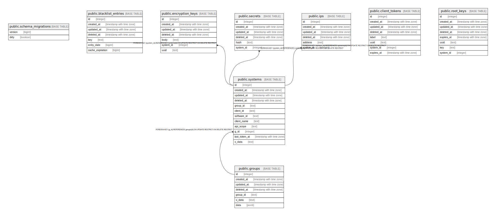

# bcda

## Tables

| Name | Columns | Comment | Type |
| ---- | ------- | ------- | ---- |
| [public.schema_migrations](public.schema_migrations.md) | 2 |  | BASE TABLE |
| [public.blacklist_entries](public.blacklist_entries.md) | 7 |  | BASE TABLE |
| [public.encryption_keys](public.encryption_keys.md) | 7 |  | BASE TABLE |
| [public.groups](public.groups.md) | 7 |  | BASE TABLE |
| [public.secrets](public.secrets.md) | 6 |  | BASE TABLE |
| [public.systems](public.systems.md) | 12 |  | BASE TABLE |
| [public.ips](public.ips.md) | 6 |  | BASE TABLE |
| [public.client_tokens](public.client_tokens.md) | 8 |  | BASE TABLE |
| [public.root_keys](public.root_keys.md) | 8 |  | BASE TABLE |

## Relations

---

> Generated by [tbls](https://github.com/k1LoW/tbls)
