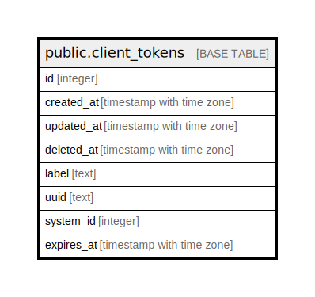

# public.client_tokens

## Description

## Columns

| Name | Type | Default | Nullable | Children | Parents | Comment |
| ---- | ---- | ------- | -------- | -------- | ------- | ------- |
| id | integer | nextval('client_tokens_id_seq'::regclass) | false |  |  |  |
| created_at | timestamp with time zone |  | true |  |  |  |
| updated_at | timestamp with time zone |  | true |  |  |  |
| deleted_at | timestamp with time zone |  | true |  |  |  |
| label | text |  | true |  |  |  |
| uuid | text |  | false |  |  |  |
| system_id | integer |  | true |  |  |  |
| expires_at | timestamp with time zone |  | true |  |  |  |

## Constraints

| Name | Type | Definition |
| ---- | ---- | ---------- |
| client_tokens_uuid_key | UNIQUE | UNIQUE (uuid) |

## Indexes

| Name | Definition |
| ---- | ---------- |
| client_tokens_uuid_key | CREATE UNIQUE INDEX client_tokens_uuid_key ON public.client_tokens USING btree (uuid) |

## Relations

---

> Generated by [tbls](https://github.com/k1LoW/tbls)
