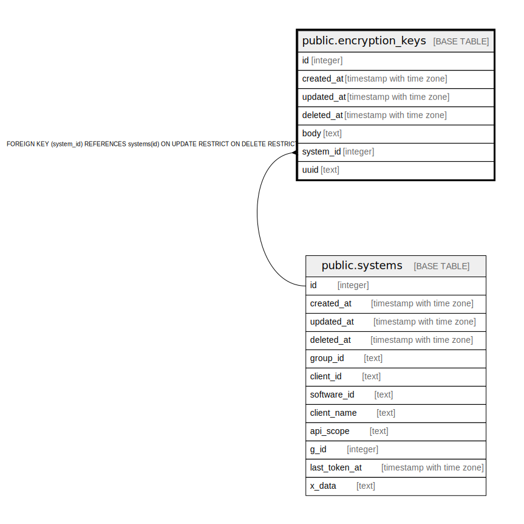

# public.encryption_keys

## Description

## Columns

| Name | Type | Default | Nullable | Children | Parents | Comment |
| ---- | ---- | ------- | -------- | -------- | ------- | ------- |
| id | integer | nextval('encryption_keys_id_seq'::regclass) | false |  |  |  |
| created_at | timestamp with time zone |  | true |  |  |  |
| updated_at | timestamp with time zone |  | true |  |  |  |
| deleted_at | timestamp with time zone |  | true |  |  |  |
| body | text |  | true |  |  |  |
| system_id | integer |  | true |  | [public.systems](public.systems.md) |  |
| uuid | text |  | true |  |  |  |

## Constraints

| Name | Type | Definition |
| ---- | ---- | ---------- |
| encryption_keys_pkey | PRIMARY KEY | PRIMARY KEY (id) |
| encryption_keys_system_id_systems_id_foreign | FOREIGN KEY | FOREIGN KEY (system_id) REFERENCES systems(id) ON UPDATE RESTRICT ON DELETE RESTRICT |

## Indexes

| Name | Definition |
| ---- | ---------- |
| encryption_keys_pkey | CREATE UNIQUE INDEX encryption_keys_pkey ON public.encryption_keys USING btree (id) |
| idx_encryption_keys_deleted_at | CREATE INDEX idx_encryption_keys_deleted_at ON public.encryption_keys USING btree (deleted_at) |

## Relations

---

> Generated by [tbls](https://github.com/k1LoW/tbls)
