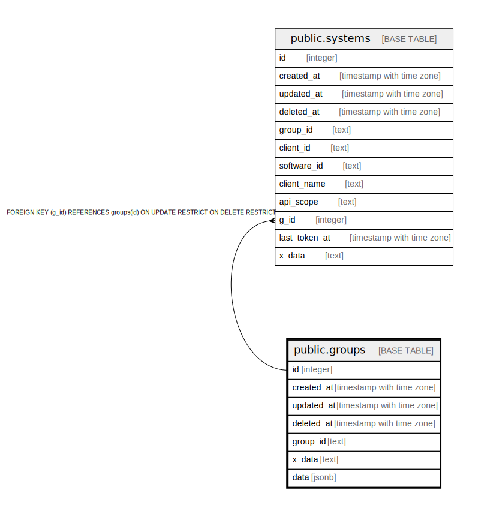

# public.groups

## Description

## Columns

| Name | Type | Default | Nullable | Children | Parents | Comment |
| ---- | ---- | ------- | -------- | -------- | ------- | ------- |
| id | integer | nextval('groups_id_seq'::regclass) | false | [public.systems](public.systems.md) |  |  |
| created_at | timestamp with time zone |  | true |  |  |  |
| updated_at | timestamp with time zone |  | true |  |  |  |
| deleted_at | timestamp with time zone |  | true |  |  |  |
| group_id | text |  | false |  |  |  |
| x_data | text |  | true |  |  |  |
| data | jsonb |  | true |  |  |  |

## Constraints

| Name | Type | Definition |
| ---- | ---- | ---------- |
| groups_pkey | PRIMARY KEY | PRIMARY KEY (id) |

## Indexes

| Name | Definition |
| ---- | ---------- |
| groups_pkey | CREATE UNIQUE INDEX groups_pkey ON public.groups USING btree (id) |
| idx_groups_deleted_at | CREATE INDEX idx_groups_deleted_at ON public.groups USING btree (deleted_at) |
| groups_group_id_deleted_at_key | CREATE UNIQUE INDEX groups_group_id_deleted_at_key ON public.groups USING btree (group_id) WHERE (deleted_at IS NULL) |

## Relations

---

> Generated by [tbls](https://github.com/k1LoW/tbls)
