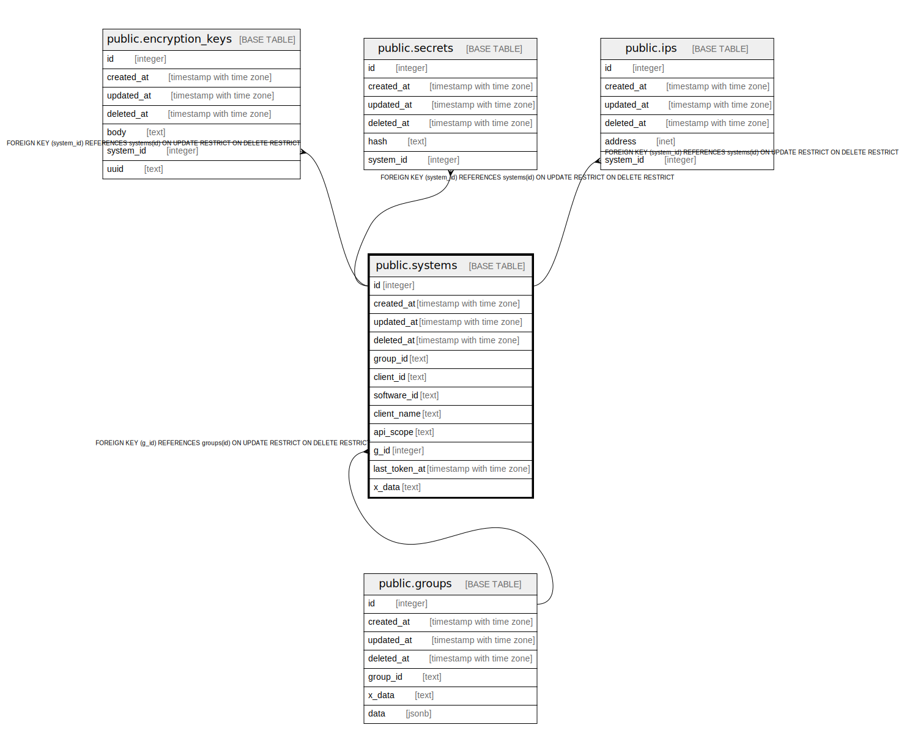

# public.systems

## Description

## Columns

| Name | Type | Default | Nullable | Children | Parents | Comment |
| ---- | ---- | ------- | -------- | -------- | ------- | ------- |
| id | integer | nextval('systems_id_seq'::regclass) | false | [public.encryption_keys](public.encryption_keys.md) [public.secrets](public.secrets.md) [public.ips](public.ips.md) |  |  |
| created_at | timestamp with time zone |  | true |  |  |  |
| updated_at | timestamp with time zone |  | true |  |  |  |
| deleted_at | timestamp with time zone |  | true |  |  |  |
| group_id | text |  | true |  |  |  |
| client_id | text |  | true |  |  |  |
| software_id | text |  | true |  |  |  |
| client_name | text |  | true |  |  |  |
| api_scope | text |  | true |  |  |  |
| g_id | integer |  | true |  | [public.groups](public.groups.md) |  |
| last_token_at | timestamp with time zone |  | true |  |  |  |
| x_data | text |  | true |  |  |  |

## Constraints

| Name | Type | Definition |
| ---- | ---- | ---------- |
| systems_g_id_groups_g_id_foreign | FOREIGN KEY | FOREIGN KEY (g_id) REFERENCES groups(id) ON UPDATE RESTRICT ON DELETE RESTRICT |
| systems_pkey | PRIMARY KEY | PRIMARY KEY (id) |

## Indexes

| Name | Definition |
| ---- | ---------- |
| systems_pkey | CREATE UNIQUE INDEX systems_pkey ON public.systems USING btree (id) |
| idx_systems_deleted_at | CREATE INDEX idx_systems_deleted_at ON public.systems USING btree (deleted_at) |
| idx_client | CREATE UNIQUE INDEX idx_client ON public.systems USING btree (client_id) |

## Relations

---

> Generated by [tbls](https://github.com/k1LoW/tbls)
